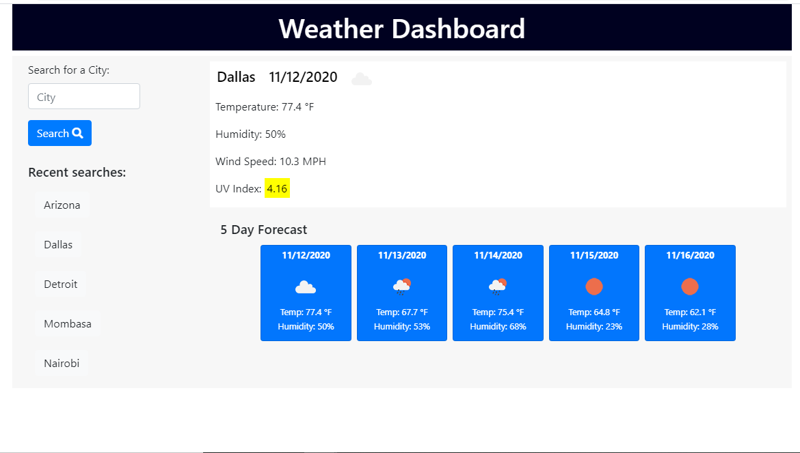

# 06 Server-Side APIs: Weather Dashboard

A weather dashboard that runs in the browser and features dynamically updated HTML and CSS. It uses the [OpenWeather API](https://openweathermap.org/api) to retrieve weather data for cities. It uses `localStorage` to store any persistent data.

The following image demonstrates the application functionality:

## Links

* The Weather Dashboard URL:

* The Weather Dashboard GitHub repository: